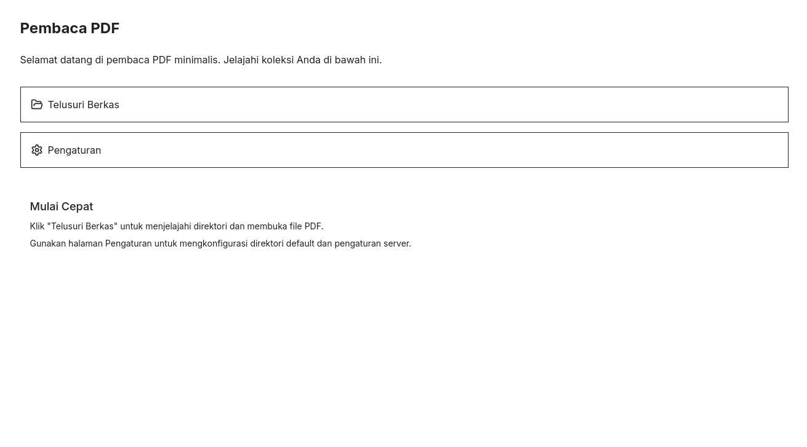
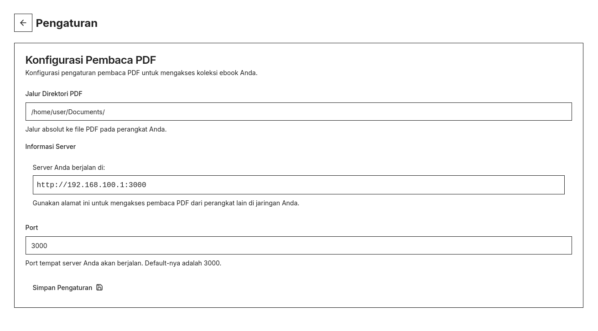

# Baca PDF

Situs pembaca PDF sederhana dan elegan yang dibangun dengan Next.js, memungkinkan pengguna untuk menjelajahi dan membaca file PDF dari direktori yang telah dikonfigurasi pada sistem Anda.

> Proyek ini dibangun menggunakan [v0.dev](https://v0.dev) sebagai bagian dari eksplorasi pembuatan UI modern dan cepat berbasis komponen. v0.dev membantu menghasilkan komponen antarmuka pengguna secara otomatis, yang kemudian disesuaikan untuk memenuhi kebutuhan spesifik.

## Fitur

- 📂 Menjelajahi direktori dan file dalam antarmuka yang ramah pengguna
- 📄 Melihat file PDF langsung di browser
- 🧭 Navigasi mudah dengan tombol kembali
- 🔍 Fokus hanya pada file PDF, dengan indikator yang jelas ketika tidak ada PDF yang tersedia
- 💻 Kompatibilitas lintas platform

## Screenshots

> Halaman Depan


> Halaman Pengaturan


## Instalasi

1. Clone repository:

```bash
git clone https://github.com/antheiz/pdf-reader.git
cd pdf-reader
```

2. Install dependencies:

```bash
npm install
# atau
yarn install
# atau
pnpm install
```

## Cara Penggunaan

1. Mulai server pengembangan:

```bash
npm run dev
# atau
yarn dev
# atau
pnpm dev
```

2. Buka [http://localhost:3000](http://localhost:3000) di browser Anda.

3. Gunakan antarmuka untuk menjelajahi direktori dan membuka file PDF.

## Struktur Proyek

- [Next.js](https://nextjs.org/) - React framework
- [React](https://reactjs.org/) - UI library
- [Shadcn UI](https://ui.shadcn.com/) - UI components
- [PDF.js](https://mozilla.github.io/pdf.js/) - PDF rendering

## Project Structure

```
pdf-reader/
├── app/                   # Direktori app Next.js
│   ├── library/           # Komponen penjelajah file
│   ├── reader/            # Komponen pembaca PDF
│   └── settings/          # Halaman pengaturan
├── components/            # Komponen React yang dibagikan
├── lib/                   # Fungsi utilitas dan logika bersama
├── public/                # Aset statis
└── README.md              # File ini
```

## Kontribusi

Kontribusi sangat diterima! Silakan ajukan Pull Request.

## Lisensi

[MIT License](LICENSE)